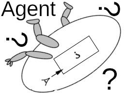

<h1 align="center" style="margin-top: 0px;">Networked Real-Time ML Agent Interface</h1>

    

&emsp;

A prototype of a python-based webserver (using the asynchronous Tornado library) which allows an ML model (interactive agent) running on a remote machine to react to, and communicate with, a user at a browser client. The performance goal for this prototype was to handle client-side mouse movements and keyboard input, and provide ML-driven feedback over the network, in realtime. 

The AI agent runs in its own process or processes (not included in this project), and sends data through shared-memory objects to the execution context containing the web server. 

The project contains a very basic prototype of a 2D renderer, to composite 2D assets into a frame. There are CPU and GPU versions of the same renderer, to allow for performance experimentation - depending on our use of local CPU resources, it may be advantageous to render on GPU. CPU-intensive tasks such as encoding a frame for transmission over http are scheduled onto a thread pool.

Old prototypes are included. Originally I had designed an API to signal the client to composite generic objects into the  UI. However, we moved towards a scenario where the model (agent) would generate a hierarchy of images, which could then be composited on the server-side.

Given that this project was intended for fast prototyping and proof-of-concept, there are no proper tests of stability, performance, nor correctness.

---